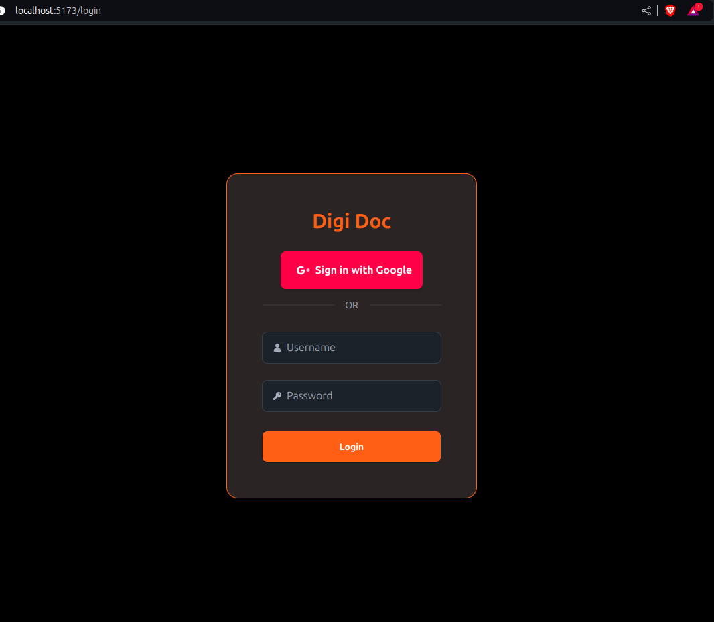
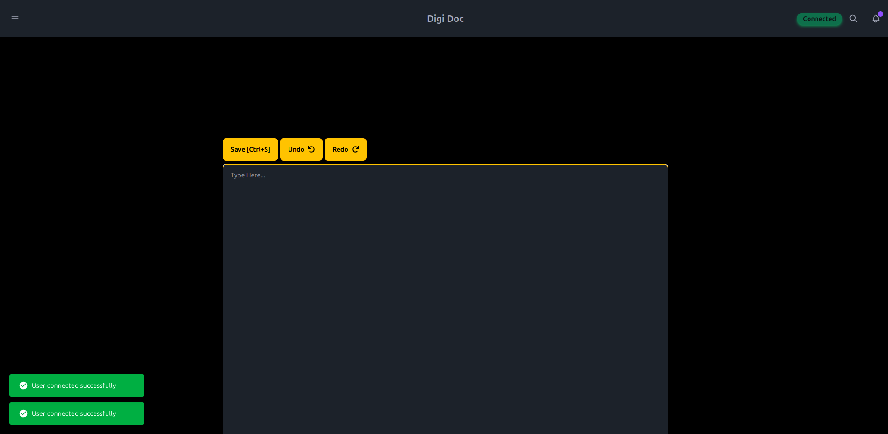

# DigiDoc

A live time document manager

## Getting Started

To get started with DigiDoc, you can follow this [Quick Start](https://github.com/KrishnanKamatchi/DigiDoc/blob/main/README.md) guide

## Steps you can do with DigiDoc

### 1. Create an account

### 2. Login

### 3. Create a document

### 4. Edit

### 5. Delete

### 6. Share

### 7. Logout

## FAQ

### 1. How to launch the server?

You can launch the server using `npm run watch` in dev mode or use one of the binay executables in the `bin` folder

### 2. How to login?

After launching the server, you can login on the `localhost:3000/login` page with your username and password
AdminCreds:

> username: admin
> password: archive

### 3. How to edit the documents?

THere is a document editor that you can use to edit the document.

Initialy we only provide a text editor. But we planned to get Quill editor as well.

## Update Log

### 1.0.0

- Initial release

## Contributors

- [Krishnan](https://github.com/KrishnanKamatchi)
